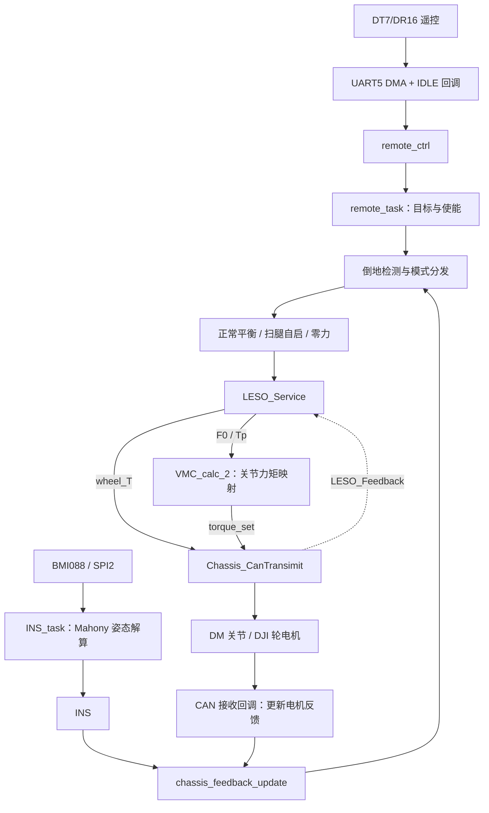

# 工程框架说明

本文依据当前工作区源码和 Keil 工程整理，包含尚未提交的代码现状。硬件为达妙 DM-MC02（STM32H723VG），软件为 C99、STM32 HAL、FreeRTOS 和 CMSIS-RTOS v1。Git 仓库根目录是固件目录的上两级 `wheel_legger/`；文中代码路径以固件目录为基准，Markdown 链接以本文件所在的 `projectmd/` 为基准。

## 1. 目录与职责

```text
Core/
  Inc/                    外设声明、FreeRTOSConfig.h
  Src/main.c              上电初始化与调度器启动
  Src/freertos.c          任务创建、优先级与任务入口
  Src/stm32h7xx_it.c      中断入口，转交 HAL 处理
User/
  APP/                    姿态、底盘、遥控任务；保留 PS2 任务
  Algorithm/              LQR、LESO、VMC、PID、Mahony、EKF 等算法
  Devices/                BMI088、DM/DJI 电机、遥控及其他设备协议
  Bsp/                    CAN、UART、USB、PWM、DWT 板级接口
  Controller/             通用 PID、模糊 PID 等控制工具
  Config/                 系统配置宏
  Lib/                    公共数学及辅助函数
USB_DEVICE/               USB CDC 应用与底层配置
Drivers/                  STM32 HAL、CMSIS 及 DSP 库
Middlewares/              FreeRTOS、USB 协议栈
MDK-ARM/                  Keil 工程、启动汇编与编译产物
mdk_check/                VMC 数值验证脚本
CtrlBoard-H7_IMU.ioc       CubeMX 配置
```

任务调度入口在 `Core/Src/freertos.c`；`User/Controller/controller.c` 提供通用控制工具。具体编译、验证命令见 [AGENTS.md](../AGENTS.md)，已有工程注意事项见 [CLAUDE.md](../CLAUDE.md)。

## 2. 上电与启动顺序

入口：[main.c](../Core/Src/main.c) 的 `main()`。

1. `HAL_Init()`、`SystemClock_Config()` 初始化 HAL 与系统时钟。
2. 初始化 GPIO、DMA、SPI2、三个 FDCAN、TIM3、UART5、USART2 和 USART10。
3. 初始化 USB、DWT 计时以及 UART DMA 双缓冲接收，等待 `SYS_DELAY_START_TIME`。
4. 循环调用 `BMI088_init()`，成功后开启可控电源并配置 CAN。
5. `MX_FREERTOS_Init()` 创建任务，`osKernelStart()` 启动调度器。

姿态任务累计约 1500 次初始化循环后置位 `INS.ins_flag`。底盘任务等待该标志，再执行 `Chassis_init()`：使能关节电机、初始化左右腿 VMC，并将底盘使能状态设为 `OFFLINE`。

## 3. 任务与共享数据

任务定义见 [freertos.c](../Core/Src/freertos.c)。

| 任务 | 优先级 | 调度方式 | 业务入口与职责 |
| --- | --- | --- | --- |
| `INS_TASK` | Realtime | 每轮 `osDelay(1)` | `INS_task()`：读取 BMI088，通过 Mahony 更新姿态 |
| `REMOTO_TASK` | High | 每轮 `osDelay(30)` | `remote_task()`：设置使能、速度、转向和腿长目标 |
| `CHASSIS_TASK` | AboveNormal | `osDelayUntil()`，目标周期 1 ms | `chassis_task()`：反馈、模式控制、扰动补偿和电机发送 |
| `defaultTask` | Normal | 每轮 `osDelay(1)` | 初始化 USB，之后延时循环 |
| `PS2_TASK` | — | 创建代码已注释 | 当前不运行 |

FreeRTOS tick 为 1 kHz。相对延时会叠加执行耗时；底盘的 1 ms 是调度目标，实际间隔由 `fb_dt` 测量，并有落后时重新对齐唤醒点的处理。

| 全局对象 | 定义位置 | 写入方 | 使用方 |
| --- | --- | --- | --- |
| `INS` | `User/APP/INS_task.c` | 姿态任务 | 底盘反馈、LQR、LESO |
| `remote_ctrl` | `User/Devices/Remote_Control/Remote_Control.c` | UART5 接收回调 | 遥控任务 |
| `Chassis` | `User/APP/chassis_task.c` | CAN 回调、遥控任务、底盘控制代码 | 各控制算法与电机发送 |

这些数据通过全局结构体共享，当前业务链没有用队列或互斥锁交接状态。新增跨任务数据时，应明确写入方、读取方及读取一致性。

## 4. 数据流与底盘控制链



核心入口：[chassis_task.c](../User/APP/chassis_task.c) 的 `chassis_task()`。每轮按以下顺序执行：

1. `chassis_feedback_update()`：读取电机和 IMU 状态，经 `VMC_calc_1()` 计算腿长、摆角及其变化率，估计车体速度和位移。
2. `YAW_Parameter_Processing()`：根据转向指令和使能状态处理目标航向。
3. `falling_down_detect()`：处理上线边沿和正常模式下的倒地判定。
4. 按 `chassis_mode` 调用模式函数。正常模式执行 `LQR()` 与 `LEG_Lenth_Control()`；自启模式执行扫腿和收腿控制。
5. `LESO_Service()`：仅在 `ONLINE && NORMAL` 时运行观测与补偿，再次进入时重新初始化观测状态。
6. `VMC_translate()`：调用左右腿 `VMC_calc_2()`，将虚拟力和力矩映射为关节力矩。
7. `Chassis_CanTransimit()`：轮力矩转换为电流，关节力矩限幅后发送，并通过 `LESO_Feedback()` 回灌控制输入。

| 模块 | 关键接口 | 在当前控制链中的作用 |
| --- | --- | --- |
| [LQR](../User/Algorithm/LQR/LQR.c) | `LQR_Calc(L_l, L_r)` | 根据左右腿长拟合增益；十维状态误差生成两轮 `wheel_T` 和两腿 `Tp` |
| `LEG_Lenth_Control` | 位于 `chassis_task.c` | 腿长 PD、重力前馈和 roll PD 生成两腿 `F0` |
| [LESO](../User/Algorithm/LESO/LESO.c) | `LESO_Service()`、`LESO_Feedback()` | 估计扰动，补偿轮力矩和腿摆力矩 |
| [VMC](../User/Algorithm/VMC/VMC_calc.c) | `VMC_calc_1()`、`VMC_calc_2()` | 反馈侧解算运动学，输出侧用雅可比映射力矩 |

模式函数通过每条腿的 `vmc.F0`、`vmc.Tp` 和轮子的 `wheel_T` 交付输出。新增控制律应沿用这些接口：在线发送时会由 `wheel_T` 重算 `SET_Current`。

## 5. 底盘使能与模式状态机

`chassis_enable` 与 `chassis_mode` 是两个独立字段。最终发送函数在 `OFFLINE` 时发送零电流、零关节力矩；模式切换由 `falling_down_detect()` 和模式函数管理。

| 模式 | 对应函数 | 行为与转换 |
| --- | --- | --- |
| `NORMAL` | `normal_mode()` | LQR 平衡与腿长控制；在线检测到倒地后进入 `ZERO_FORCE` |
| `ZERO_FORCE` | `zero_force()` | 清除腿和轮输出，等待重新使能 |
| `FALLING_DOWN` | `falling_down()` | 扫腿自启；两腿到位后进入 `FALLING_TO_NORMAL`，超时进入 `ZERO_FORCE` |
| `FALLING_TO_NORMAL` | `falling_to_down()` | 收腿并检查姿态、腿长和腿长变化率；满足条件回到 `NORMAL`，超时进入 `ZERO_FORCE` |

遥控 `s2` 为 2/0 时关闭，为 1/3 时开启。每次 `OFFLINE → ONLINE` 都重新检查姿态：满足站立窗口则进入 `NORMAL`，否则进入 `FALLING_DOWN`。当前判据使用两腿 `phi0` 和机体 pitch；参数应以源码为准。

## 6. 硬件接口与索引约定

CAN 当前使用经典帧。发送映射定义在 [chassis_task.h](../User/APP/chassis_task.h)，接收分发在 [bsp_can.c](../User/Bsp/bsp_can.c)。

| 接口 | 当前连接及用途 |
| --- | --- |
| FDCAN1 | 两个 DJI M3508 轮电机、右腿两个 DM 关节；轮反馈 0x201 对应右轮、0x202 对应左轮，电流指令共用 0x200 |
| FDCAN2 | 左腿两个 DM 关节 |
| FDCAN3 | 已配置，当前底盘没有接入设备 |
| SPI2 | 板载 BMI088 |
| UART5 | DT7/DR16 遥控，DMA 双缓冲与 IDLE 接收；代码解析函数名为 `SBUS_TO_RC()` |
| USART2 / USART10 | 宇树电机、步进电机接收接口，当前不参与底盘平衡输出 |
| USB CDC | USB 通信基础设施，上位机控制解析仍为模板 |

左右腿索引为 `LEFT_Leg=0`、`RIGHT_Leg=1`；轮索引为 `LEFT_Wheel=1`、`RIGHT_Wheel=0`。关节数组索引为对应 TxID 减 1。右腿镜像在反馈侧和关节输出侧已经处理，控制算法使用统一坐标。

## 7. 已编译与实际启用的区别

以 [Keil 工程](../MDK-ARM/CtrlBoard-H7_IMU.uvprojx) 的源文件清单和任务调用为准。

| 模块 | 当前状态 |
| --- | --- |
| Mahony | 姿态任务实际使用 |
| QuaternionEKF、Kalman | 工程包含，当前姿态任务没有调用其滤波更新 |
| PS2 | 设备和任务源码包含，任务创建与主任务调用已注释 |
| Unitree、Stepper | 驱动和 UART 接收接口保留，未接入底盘控制输出 |
| PC_Comm | 工程包含，上位机解包实现仍为注释模板 |
| `User/Devices/DT7_Remote/` | 目录存在，但未列入当前 Keil 工程；实际遥控使用 `Remote_Control` |

## 8. 修改功能时从哪里开始

| 修改目标 | 优先查看 |
| --- | --- |
| 平衡、自启、倒地判定、输出限幅 | `User/APP/chassis_task.c/.h` |
| 遥控档位、速度、转向、腿长目标 | `User/APP/Remote_task.c` |
| IMU 安装方向、姿态与角速度符号 | `User/APP/INS_task.c`、`chassis_feedback_update()` |
| LQR 增益与物理参数 | `User/Algorithm/LQR/LQR.c`、`User/Algorithm/some_config/` |
| 扰动补偿、观测器矩阵 | `User/Algorithm/LESO/LESO.c/.h` |
| 腿部几何、运动学与雅可比 | `User/Algorithm/VMC/VMC_calc.c/.h` |
| CAN 总线或电机 ID | `chassis_task.h` 与 `User/Bsp/bsp_can.c` 同步修改 |
| 任务优先级、栈和周期 | `Core/Src/freertos.c`、`Core/Inc/FreeRTOSConfig.h`、对应任务实现 |

LQR/LESO 系数由上一级的 `../ABK_LQR.py`、`../lqr_k_calc/hku_lqr_k_calc.py` 等离线工具计算后手工更新；修改控制周期需同步检查离散模型和 LESO 内部时间步长。

修改前阅读 `CLAUDE.md` 的编码与 CubeMX 注意事项：源码混用 GBK、UTF-8 和不同换行格式，应按原编码进行字节级修改；CubeMX 配置与手工 RTOS 修改并不完全一致。新增源文件时同步更新 Keil 工程；EIDE 配置当前不完整。
